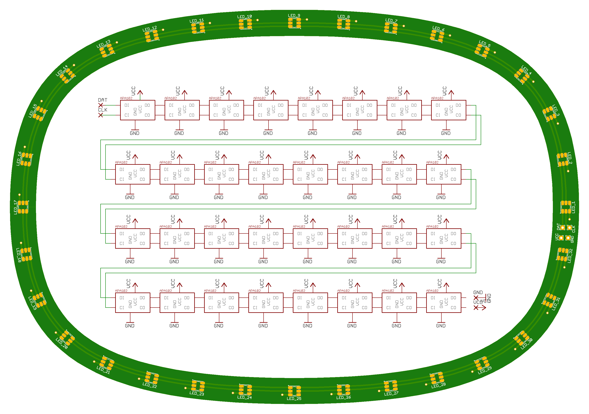

# Lights

Design and source code for controlling a ring of LEDs via Bluetooth LE. More context for the project [here](https://medium.com/@maxbraun/smarter-mirrors-and-how-theyre-made-327997b9eff7).

[](https://medium.com/@maxbraun/smarter-mirrors-and-how-theyre-made-327997b9eff7)

## Eagle

The light ring PCB design is defined in an [Eagle project](eagle) ready for fabrication. It uses [APA102 5050 RGB LEDs](https://www.adafruit.com/product/2343).



## Arduino

The PCB (5V) is connected to an [Adafruit Feather with BLE](https://www.adafruit.com/product/2829) (3.3V) with a [logic level converter](https://www.adafruit.com/product/757). After [board setup](https://learn.adafruit.com/adafruit-feather-32u4-bluefruit-le/setup) select `Adafruit Feather 32u4` as the board and `USBtinyISP` as the programmer.

The [Arduino code](arduino/lights.ino) contains the [pin definitions](arduino/lights.ino#L19) and has three library dependencies:
* [APA102](https://github.com/pololu/apa102-arduino#software)
* [Adafruit Bluefruit LE](https://github.com/adafruit/Adafruit_BluefruitLE_nRF51)
* [FastGPIO](https://github.com/pololu/fastgpio-arduino)


## Android

The [Android Studio project](android) builds an apk with a background service maintaining the BLE connection.

Bind to the service from another app and send commands using the [AIDL](android/app/src/main/aidl/net/maxbraun/lights) interface.

You can also use the [debug UI](android/app/src/main/java/net/maxbraun/lights/DebugActivity.java) or send intents to the [debug service](android/app/src/main/java/net/maxbraun/lights/DebugService.java):

```
adb shell am startservice net.maxbraun.lights/.DebugService
adb shell am broadcast -a net.maxbraun.lights.ALL_WHITE
```

## License

Copyright 2017 Max Braun

Licensed under the Apache License, Version 2.0 (the "License");
you may not use this file except in compliance with the License.
You may obtain a copy of the License at

    http://www.apache.org/licenses/LICENSE-2.0

Unless required by applicable law or agreed to in writing, software
distributed under the License is distributed on an "AS IS" BASIS,
WITHOUT WARRANTIES OR CONDITIONS OF ANY KIND, either express or implied.
See the License for the specific language governing permissions and
limitations under the License.
